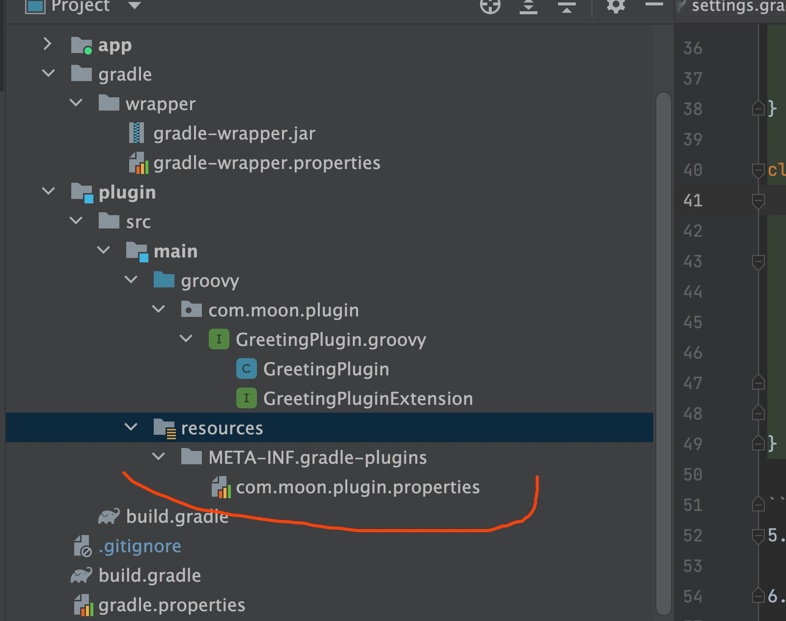

# AppStudyDemo

## 自定义插件化
自定义 gradle 插件一共有三种方式：Build script、 buildSrc project、Standalone project。前两种方式参考引用内容

### 环境
Android Studio Dolphin | 2021.3.1

### 开发自定义插件步骤
1. 新建GradlePlugin
   Android Studio 中新建一个 Project，然后建立一个 Android Module（类型不重要，因为默认文件会删除），
然后删除掉目录下除了 src/main 和 build.gradle 之外的其他内容，再 build.gradle 内容清空。
2. 在 src/main/ 目录下创建一个 groovy 目录，用于存放 Gradle 插件代码。

3. 在 Android Module 的 build.gradle 中添加 gradle sdk和 groovy 语言支持：
```
plugins {
    id 'groovy'
}

dependencies {
    //gradle sdk
    implementation gradleApi()
    //groovy sdk
    implementation localGroovy()
}
```
4. 实现具体的 Gradle 插件代码
```groovy
package com.moon.plugin
import org.gradle.api.*
import org.gradle.api.provider.Property;

interface GreetingPluginExtension {
    Property<String> getMessage()

    Property<String> getGreeter()
}

class GreetingPlugin implements Plugin<Project> {
    void apply(Project project) {
        def extension = project.extensions.create('greeting', GreetingPluginExtension)
        project.task('hello') {
            doLast {
                println "${extension.message.get()} from ${extension.greeter.get()}"
            }
        }
    }
}

```
5. 创建 properties 文件，以便让 Gradle 找到 GreetingPlugin 类。
目录结构如下：

文件内容如下：
> implementation-class=com.moon.plugin.GreetingPlugin

**注意**：.properties 文件的文件名，即为使用该插件时的“插件名称”。
6. 发布插件
为了在其他地方使用该插件，必须要先进行插件发布。
```
   plugins {
   id 'groovy'
   id 'maven-publish'
   }


dependencies {
//gradle sdk
implementation gradleApi()
//groovy sdk
implementation localGroovy()
}

afterEvaluate {

}

//定义插件的在本地 maven 中的 id
publishing {
repositories {
maven {
// 发布位置
url uri('/Volumes/Android/repository')
//            //指定要上传的maven私服仓库
//            url = "http://jenkins.maxrocky.com:8080/maven/content/repositories/thirdparty/"
// 允许使用 http
//            allowInsecureProtocol = true
//            //认证用户和密码
//            credentials {
//                username 'admin'
//                password 'maxrocky5721'
//            }
}
}

    publications {
        mavenJava(MavenPublication) {
            groupId 'com.moon'
            artifactId 'plugin'
            //定义插件的在本地 maven 中的版本号
            version '1.0.1'
            from components.java
        }
    }
}
```


### 自定义 Gradle 插件的使用
1. 在settings.gradle 添加如下
```
pluginManagement {
    repositories {
        maven {
            url uri('/Volumes/Android/repository')
        }
        gradlePluginPortal()
        google()
        mavenCentral()
    }
    resolutionStrategy {
        eachPlugin {
            if (requested.id.namespace == "com.moon") {
                useModule("com.moon:plugin:1.0.1")
            }
        }
    }
}
```
2. 在module 的build.gradle中应用这个插件
>   id 'com.moon.plugin'

点击同步，找到插件任务

## 参考
[Gradle Task](!https://blog.csdn.net/u011578734/article/details/113438050)
[创建自定义gradle插件的三种方法](!https://blog.csdn.net/u011578734/article/details/113438050)
[gradle](!https://docs.gradle.org/current/userguide/custom_plugins.html)